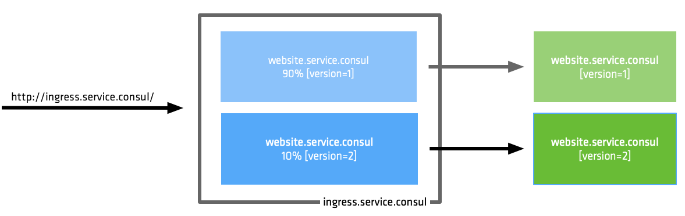
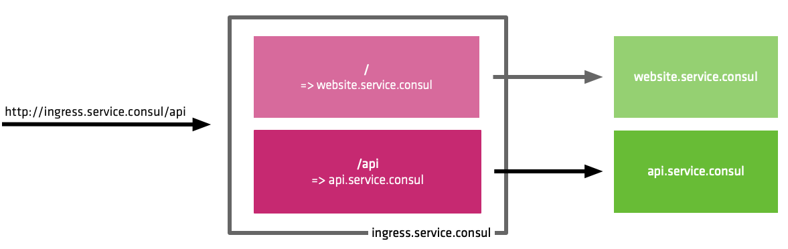

# Consul Service Mesh Demos
This repository contains various demonstrations to highlight features and configuration in Consul Service Mesh.

## Docker Compose
**NOTE**: All service registration and central config is automatically applied when running these examples.  
To apply configuration manually you can comment out the `CENTRAL_CONFIG` environment variable in the docker-compose.yml files:
```yaml
  web_envoy:
    image: nicholasjackson/consul-envoy:v1.6.0-v0.10.0
    environment:
      CONSUL_HTTP_ADDR: 10.5.0.2:8500
      CONSUL_GRPC_ADDR: 10.5.0.2:8502
      SERVICE_CONFIG: /config/web_v1.json
#     CENTRAL_CONFIG: "/central_config/web-defaults.hcl;/central_config/api-defaults.hcl;/central_config/api-v1-defaults.hcl;/central_config/api-v2-defaults.hcl;/central_config/api-router.hcl"
    volumes:
      - "./service_config:/config"
      - "./central_config:/central_config"
    command: ["consul", "connect", "envoy","-sidecar-for", "web-v1"]
    network_mode: "service:web"
```

Config can then be manually applied using the following command once you have started the example with `docker-compose up`:
```
$ consul config write config_file.hcl
```

All central config is stored in the `central_config` folder in each example.

### [Traffic Splitting](traffic_split/)
This demonstration shows how traffic can be split between two service instances. This feature could be used for a Canary or Dark deployment testing strategy.



### [Traffic Routing](traffic_routing/)
This demonstration shows how upstream traffic can be routed between two services using HTTP paths.



### [Metrics / Tracing](metrics_tracing/)
This demonstration shows how to configure Consul Service Mesh for Observability.


### [Service Failover](failover/)
This demonstration shows how to failover upstream services to a different datacenter. This feature could be used to main uptime during a partial or regional service outage.


### [Consul Gateways](gateways/)
This demonstration shows how to route traffic to a second Consul Datacenter using Consul Gateways. This feature could be used to route traffic between Virtual Machines and Kubernetes.


## Kubernetes

### [Traffic Splitting](kubernetes/traffic_splitting/)
This demonstration shows how traffic can be split between two service instances. This feature could be used for a Canary or Dark deployment testing strategy.


### [Traffic Routing](kubernetes/traffic_routing/)
This demonstration shows how upstream traffic can be routed between two services using HTTP paths.

### [Exposing Health Checks](expose/)
Example showing how to bypass proxy security to expose Service health checks publicly.
