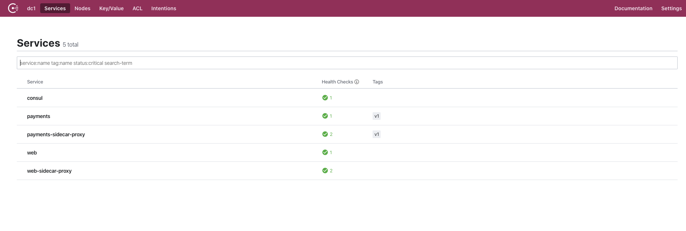

# Exposing Health Checks - Consul 1.6.2 or later

This example demonstrates how to expose a health check for your service publicly while protecting the other endpoints with mTLS .

The example consists of two services:

* Web (publicly accessible at 9090)
* Payments (health check only accessible at 9091)

Access to the payments service is protected by the service mesh, the service is listening to `localhost:9090`, inbound traffic must flow through the envoy proxy. While this approach secures access to the service there may be situations where certain paths have a lower level of security, for example access to metrics or heath checks. The following example shows how to use central configuration to expose only the `health` endpoint at a public address while securing the remainder of the service with mTLS.

To enable this you can use the `Expose` block in the `service-defaults`, this block allows you to configure exceptions for specific paths.

[https://www.consul.io/docs/agent/config-entries/service-defaults.html#expose](https://www.consul.io/docs/agent/config-entries/service-defaults.html#expose)

The example payments service has a health check endpoint which is located at the path `/health`, to expose this publicly you can define a `Path`. The example below will make the path `/health` on port `9090` of the payments service accessible via the Envoy proxy at port `9091`.

```ruby
# Requires Consul 1.6.2

Kind = "service-defaults"
Name = "payments"

Protocol = "http"

MeshGateway = {
  mode = "local"
}

Expose = {
  Paths = [
    {
      Path = "/health"
      LocalPathPort = 9090
      ListenerPort = 9091
    }
  ]
}
```

You can start the example using the command `docker-compose up`.

```shell
➜ docker-compose up
Creating network "expose_vpcbr" with driver "bridge"
Creating expose_web_1            ... done
Creating expose_consul_1         ... done
Creating expose_payments_v1_1 ... done
Creating expose_payments_proxy_1
```



Port `9091` on the `paymentsj-sidecar-proxy` has been exposed to the localhost, however; until you apply the central configuration there will be no listener at this address. Test this by curling `localhost:9091`.

```shell
➜ curl localhost:9091/health
curl: (52) Empty reply from server
```

Now apply the central config for the payments service:

```
consul config write ./central_config/payments-defaults.hcl
```

When the configuration is applied Consul will re-configure the Envoy proxy associated with the Payments service. A plain HTTP listener will be create on port `9091` with the path `/health`, requests sent to this path and port will be forwarded to the payments service at path `/health`. You can test this by again running curl.

```shell
➜ curl localhost:9091/health
curl: (52) Empty reply from server
```

Now the request is correctly sent to the health endpoint. 

All other traffic is not forwarded, this can be tested by curling the main service endpoint `/`, this will give no response as only explicitly configured paths will be forwarded to the service.

```
➜ curl localhost:9091/
```

## Stopping the example

```
docker-compose down -v
```