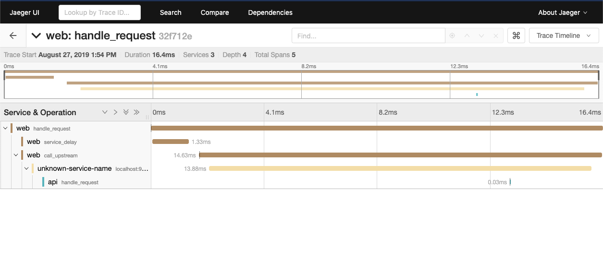

# Metrics and Tracing
This example shows how to enable metrics and tracing with Consul Service Mesh

## Configuration

### Metrics
Metric output in Envoy can be configured using the various configuration options [https://www.consul.io/docs/connect/proxies/envoy.html#bootstrap-configuration](https://www.consul.io/docs/connect/proxies/envoy.html#bootstrap-configuration). The following example configures Envoy to use prometheus metrics:

```
kind = "proxy-defaults"
name = "global"

config {
  envoy_prometheus_bind_addr = "0.0.0.0:9102"
}
```

To configure Prometheus to scrape the Envoy data plane prometheus scrape config can be used. The following example discovers the services `api` and `web` in the consul service catalog
and changes the port to use the one defined in the bind_addr.

```
  - job_name: 'envoy-metrics'

    scrape_interval: 10s
    scrape_timeout: 5s	

    consul_sd_configs:
      - server: '10.5.0.2:8500'
        services: 	 
          - api
          - web
 
    relabel_configs:
      - source_labels: [__address__]
        separator:     ':'
        regex:         '(.*):(.*)'
        target_label:  '__address__'
        replacement:   '${1}:9102'

```

### Tracing
Tracing is a little more complex to setup, to enable tracing the `envoy_extra_static_clusters_json` and `envoy_tracing_json` configuration elements must be defined. These blocks are raw envoy config. The `envoy_extra_static_clusters_json` defines a static envoy cluster which points at the Jaeger tracing collection endpoint. The `envoy_tracing_json` defines Envoys tracing configuration, in this example we are using the zipkin format. Details of other tracing formats can be found in the Envoy documentation [https://www.envoyproxy.io/docs/envoy/v1.10.0/api-v2/config/trace/v2/trace.proto#](https://www.envoyproxy.io/docs/envoy/v1.10.0/api-v2/config/trace/v2/trace.proto#).

```
kind = "proxy-defaults"
name = "global"

config {
  envoy_prometheus_bind_addr = "0.0.0.0:9102"

  envoy_extra_static_clusters_json = <<EOL
    {
      "connect_timeout": "3.000s",
      "dns_lookup_family": "V4_ONLY",
      "lb_policy": "ROUND_ROBIN",
      "load_assignment": {
          "cluster_name": "jaeger_9411",
          "endpoints": [
              {
                  "lb_endpoints": [
                      {
                          "endpoint": {
                              "address": {
                                  "socket_address": {
                                      "address": "jaeger",
                                      "port_value": 9411,
                                      "protocol": "TCP"
                                  }
                              }
                          }
                      }
                  ]
              }
          ]
      },
      "name": "jaeger_9411",
      "type": "STRICT_DNS"
    }
  EOL

  envoy_tracing_json = <<EOL
    {
        "http": {
            "config": {
                "collector_cluster": "jaeger_9411",
                "collector_endpoint": "/api/v2/spans"
            },
            "name": "envoy.zipkin"
        }
    }
  EOL
}
```

### Running the example
To run the example you can use the following command:

```
$ docker-compose up
```

Then curl the webservice which will create metrics and tracing data:

```
$ curl localhost:9090
# Reponse from: web #
Hello World
## Called upstream uri: grpc://localhost:9091
  # Reponse from: api #
  API V1
  % 
```

The Jaeger UI can be viewed at the following URL: [http://localhost:16686/search](http://localhost:16686/search). If you search for the service 'web', you will be able to view a trace from the system.



NOTE:
Tracing works by using a relational configuration between the individual spans. The ID of a parent span is added the child span in order to show hierarchical data. When calling an upstream you must append the parent id from the initial request to your upstream calls. Envoy can not manage this automatically.

